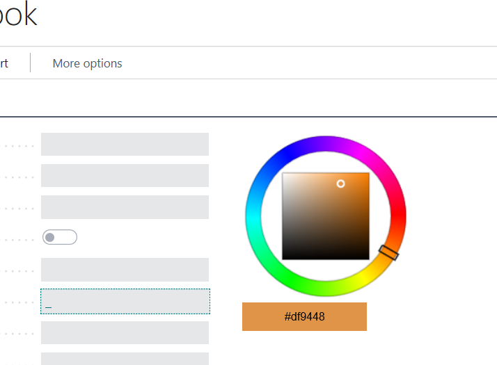

# B365JavascriptColorPicker
Javascript Color Picker control-addin for Dynamics NAv Business Central. Returns color hex code.

1. Copy contents of Colorpicker folder into your B365 Controladdin folder. 
2. Add usercontrol field to a page. (exmaple provided)
3. Enjoy!

Javascript part is based on the amazing work of NC22 @ https://github.com/NC22/HTML5-Color-Picker
Cheers!
